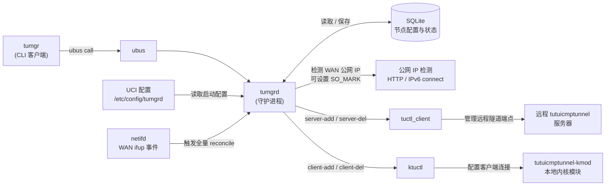
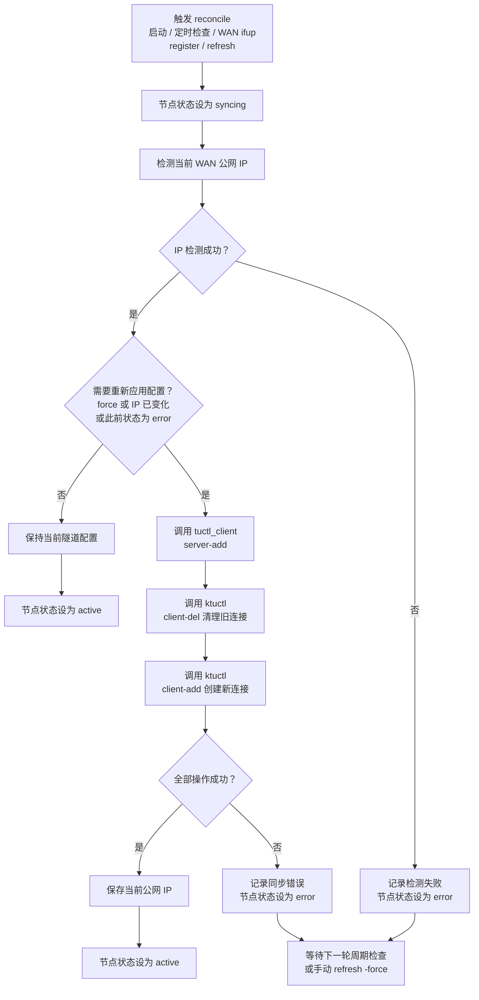
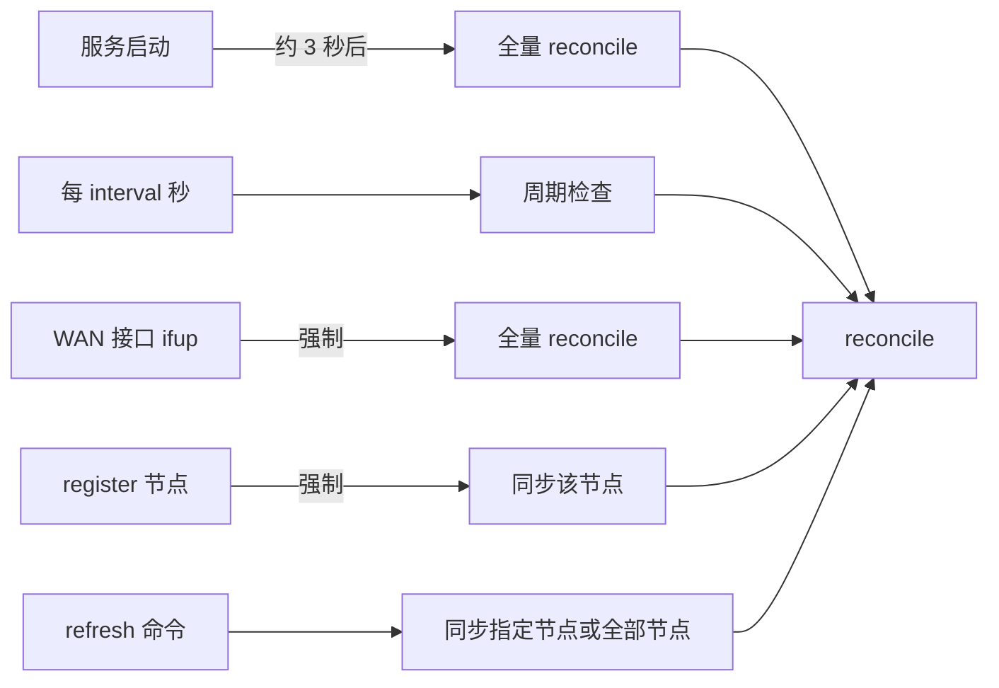
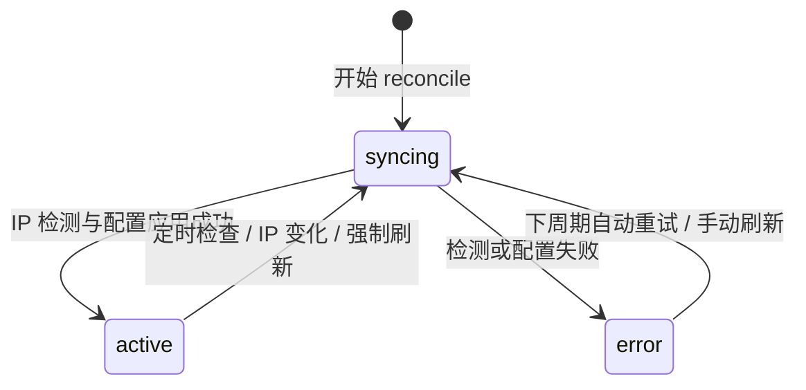
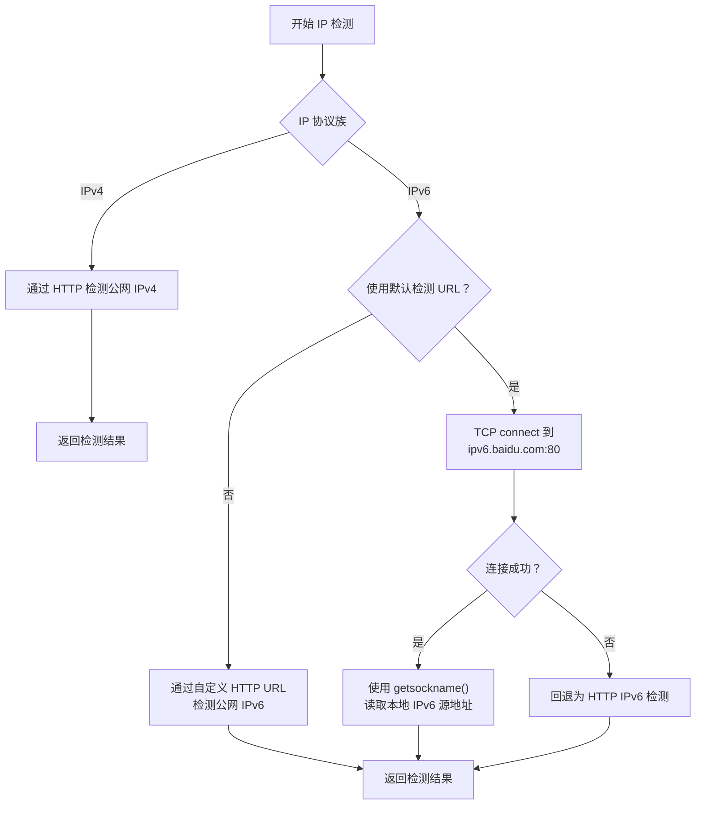
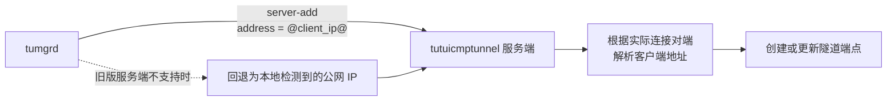

# tumgrd

运行在 OpenWrt 上的 `tutuicmptunnel` 节点管理守护进程。

`tumgrd` 用于维护 ICMP 隧道两端的配置：它向远程 `tutuicmptunnel` 服务器注册本机隧道端点，并通过 `ktuctl` 配置本地 [`tutuicmptunnel-kmod`](https://github.com/hrimfaxi/tutuicmptunnel-kmod) 内核模块的客户端连接。

它主要面向公网 IP 会动态变化的家庭宽带、企业网关等场景。当 WAN 公网 IP 变化、WAN 接口重新上线，或节点此前同步失败时，`tumgrd` 会自动重新应用隧道配置，无需手动删除并重新注册节点。

## 功能特性

- **节点全生命周期管理**：注册、注销、刷新、查询；节点配置持久化到 SQLite，服务重启后自动恢复。
- **公网 IP 自动检测**：支持 IPv4 / IPv6 HTTP 检测，以及 IPv6 TCP connect 探测；可按节点覆盖检测 URL。
- **自动同步与自愈**：
  - 公网 IP 变化时自动重新配置；
  - WAN 接口触发 `ifup` 时强制同步；
  - 节点处于 `error` 状态时在下一轮检查中自动重试；
  - 启动后自动恢复已保存节点。
- **`@client_ip@` 服务端解析**：可将客户端地址交给服务端解析，降低本地公网 IP 检测错误、多层 NAT 等场景的影响。
- **XOR 密钥自动生成**：可为新注册节点自动生成 XOR 密钥。
- **透明代理共存**：公网 IP 检测流量可设置 `SO_MARK`，避免被本机透明代理或策略路由错误劫持。
- **ubus 管理接口**：可通过 `tumgr` CLI 或直接调用 `ubus` 管理节点。

## 工作原理

### 架构



组件职责：

| 组件 | 职责 |
|---|---|
| `tumgrd` | 常驻守护进程；维护节点期望状态和运行状态；提供 `ubus` 对象 `tumgrd`。 |
| `tumgr` | Shell CLI 客户端，对 `ubus call tumgrd ...` 进行封装。 |
| `tuctl_client` | 向远程 `tutuicmptunnel` 服务端添加或删除隧道端点。 |
| `ktuctl` | 配置本地 `tutuicmptunnel-kmod` 内核模块的客户端连接。 |
| SQLite | 保存节点配置与最近一次同步状态，以便服务重启后恢复。 |

### 节点数据模型

一个节点由以下字段唯一标识：

```text
(server_host, server_port, uid, ip_version)
```

其中：

- `server_host`：远程隧道服务器地址；
- `server_port`：远程隧道服务器端口；
- `uid`：节点标识；
- `ip_version`：`ipv4`、`ipv6` 或留空自动选择。

同一远程服务器、同一 IP 协议族下，`client_port` 必须唯一。若注册的节点与已有节点发生端口冲突，数据库约束会拒绝该操作。

### 自动同步流程

`tumgrd` 使用 reconcile 机制，将数据库中的节点期望配置重新应用到远程服务端和本地内核模块。



同步判断逻辑可概括为：

```text
need_apply = force || ip_changed || was_error
```

即满足以下任一条件时，节点会重新应用配置：

- 调用了强制刷新；
- 检测到公网 IP 改变；
- 节点上一次同步处于 `error` 状态。

### 自动同步触发时机



| 触发时机 | 行为 |
|---|---|
| 守护进程启动后约 3 秒 | 对所有已保存节点执行一次全量 reconcile。 |
| 每隔 `interval` 秒 | 检查节点公网 IP 和状态；IP 变化或节点异常时重新应用。 |
| WAN 接口触发 `ifup` | 强制对全部节点执行 reconcile。 |
| `register` 成功后 | 立即对该节点执行一次强制同步。 |
| `refresh` 命令 | 手动同步指定节点或全部节点。 |

### 节点状态



| 状态 | 含义 |
|---|---|
| `active` | 节点最近一次同步成功，本地与远程配置应处于正常状态。 |
| `syncing` | 正在检测 IP 或执行远程、本地隧道配置。 |
| `error` | 上一次同步失败；下一轮周期检查会自动尝试恢复。 |

## 公网 IP 检测

默认 IP 检测 URL：

```text
http://ip.3322.net/
```

可在注册节点时通过 `ip_check_url` 为单个节点覆盖默认检测地址。

### IPv4 与 IPv6 检测策略



- IPv4 通常通过 HTTP 请求检测公网出口地址。
- IPv6 使用默认检测 URL 时，优先进行 TCP connect 探测：
  1. 向 `ipv6.baidu.com:80` 发起 TCP 连接；
  2. 通过 `getsockname()` 读取实际使用的本地 IPv6 源地址；
  3. 若探测失败，再回退到 HTTP 检测。
- 自定义 `ip_check_url` 时，按指定 URL 执行 HTTP 检测。

> 当前仅支持 `http://` 检测 URL，不支持 `https://`。

### 与透明代理共存

公网 IP 检测流量会设置 `SO_MARK`，默认值为 `2`。这样可配合策略路由规则，让检测连接绕过本机透明代理，例如 `xtp-rs`、TPROXY 或其他基于防火墙标记的代理方案。

可通过守护进程参数调整：

```bash
tumgrd --fwmark 2
```

## `@client_ip@` 占位符

当启用 `use_client_ip` 时，`tumgrd` 会在向远程服务端执行 `server-add` 时，将地址字段设置为：

```text
@client_ip@
```

由远程 `tutuicmptunnel` 服务端根据实际连接对端解析客户端 IP。



这在以下场景尤其有用：

- 本地公网 IP 检测服务返回错误地址；
- 客户端处于多层 NAT 后；
- IPv4 / IPv6 出口路由复杂；
- 服务端看到的源地址比客户端本地检测结果更可信。

如果远程 `tuctl_server` 版本不支持该占位符，`tumgrd` 会回退为使用本地检测到的公网 IP。

默认启用该功能；可通过 `--no-client-ip` 禁用。

## 安装

### 依赖

运行环境：

- OpenWrt；
- `libubus`、`libubox`；
- `sqlite3`、`libsqlite3`；
- `libuci`：可选，用于 WAN 接口检测；
- `tutuicmptunnel-kmod` 内核模块；
- `tuctl_client`、`ktuctl` 工具。

其中 `tuctl_client`、`ktuctl` 来自 [`tutuicmptunnel-kmod`](https://github.com/hrimfaxi/tutuicmptunnel-kmod) 项目。

### 本机构建

```bash
mkdir build
cd build
cmake ..
make
```

### OpenWrt 交叉编译

以 aarch64 为例：

```bash
mkdir build-aarch64
cd build-aarch64
cmake -DCMAKE_TOOLCHAIN_FILE=../openwrt-aarch64.cmake ..
make
```

项目提供以下 toolchain 文件：

- `openwrt-aarch64.cmake`
- `openwrt-x86_64.cmake`
- `openwrt-ramips.cmake`

### 构建 OpenWrt 安装包（ipk / apk）

参见 [`openwrt-tumgrd`](https://github.com/hrimfaxi/openwrt-tumgrd) 仓库说明。

### 部署到 OpenWrt

将文件复制到路由器：

```bash
# 守护进程
scp tumgrd root@<router>:/usr/sbin/tumgrd

# CLI 客户端
scp tumgr root@<router>:/usr/bin/tumgr

# init 脚本和 UCI 配置
scp contrib/etc/init.d/tumgrd root@<router>:/etc/init.d/tumgrd
scp contrib/etc/config/tumgrd root@<router>:/etc/config/tumgrd
```

在路由器上设置 CLI 可执行权限并启用服务：

```bash
ssh root@<router> 'chmod +x /usr/bin/tumgr'
ssh root@<router> '/etc/init.d/tumgrd enable'
ssh root@<router> '/etc/init.d/tumgrd start'
```

## UCI 配置

配置文件：`/etc/config/tumgrd`

```uci
config tumgrd 'main'
    option enabled '1'
    option database '/lib/tumgrd/tumgrd.db'
    option interval '60'
    option log_level 'info'
    option enable_xor '1'
    option use_client_ip '1'
```

| 选项 | 默认值 | 说明 |
|---|---:|---|
| `enabled` | `1` | 是否启用服务。 |
| `database` | `/lib/tumgrd/tumgrd.db` | SQLite 数据库路径。 |
| `interval` | `60` | 周期检查间隔，单位为秒。 |
| `log_level` | `info` | 日志级别：`error`、`warn`、`info`、`debug`、`trace`。 |
| `enable_xor` | `0` | 是否为新注册节点自动生成 XOR 密钥。 |
| `use_client_ip` | `1` | 是否使用 `@client_ip@` 占位符交由服务端解析客户端地址。 |

## 使用

### `tumgr` CLI

#### 注册节点

```bash
tumgr register -uid my-node-01 \
  -server-host 192.168.1.100 \
  -server-port 14801 \
  -client-port 1443 \
  -psk my-secret-password \
  -description "主服务器" \
  -client-comment "my-node-01"
```

可选参数：

```text
-memlimit <bytes>
-ip-check-url <url>
-ip-version <ipv4|ipv6>
```

例如设置 1 MiB 内存限制：

```bash
tumgr register -uid my-node-01 \
  -server-host 192.168.1.100 \
  -server-port 14801 \
  -client-port 1443 \
  -psk my-secret-password \
  -memlimit 1048576
```

#### 注销节点

```bash
tumgr deregister -uid my-node-01 \
  -server-host 192.168.1.100 \
  -server-port 14801 \
  -ip-version ipv4
```

#### 手动刷新

刷新一个节点：

```bash
tumgr refresh -uid my-node-01 \
  -server-host 192.168.1.100 \
  -server-port 14801 \
  -ip-version ipv4 \
  -force
```

刷新全部节点：

```bash
tumgr refresh -all -force
```

未指定 `-force` 时，仅在公网 IP 发生变化或节点状态为 `error` 时重新应用配置。

#### 查看状态

```bash
tumgr status
tumgr status -json
tumgr dump
```

- `status`：表格格式状态；
- `status -json`：JSON 格式状态；
- `dump`：输出原始节点 JSON 数据。

## ubus API

守护进程暴露的 ubus 对象：

```text
tumgrd
```

可直接调用：

```bash
ubus call tumgrd status
```

### 方法概览

| 方法 | 用途 |
|---|---|
| `register` | 创建或更新一个节点，并立即尝试同步。 |
| `deregister` | 删除一个节点，并清理远程和本地隧道配置。 |
| `refresh` | 手动刷新指定节点或全部节点。 |
| `status` | 获取节点状态列表。 |
| `dump` | 获取完整原始节点数据。 |

### `register`

示例：

```bash
ubus call tumgrd register '{
  "uid": "my-node-01",
  "server_host": "192.168.1.100",
  "server_port": 14801,
  "client_port": 1443,
  "psk": "my-secret",
  "memlimit": 1048576
}'
```

参数：

| 参数 | 必填 | 说明 |
|---|---:|---|
| `uid` | 是 | 节点唯一标识；不能为空，不能包含空白字符或控制字符。 |
| `server_host` | 是 | 远程 `tutuicmptunnel` 服务器主机名或 IP 地址。 |
| `server_port` | 是 | 远程服务端端口。 |
| `client_port` | 是 | 本地客户端使用的端口。 |
| `psk` | 是 | 预共享密钥。 |
| `description` | 否 | 节点描述。 |
| `client_comment` | 否 | 本地客户端备注。 |
| `memlimit` | 否 | 内存限制；大于 `0` 时设置，传入 `0` 时清除。 |
| `ip_check_url` | 否 | 覆盖默认公网 IP 检测 URL。 |
| `ip_version` | 否 | `ipv4`、`ipv6`，或留空自动选择。 |
| `xor` | 否 | 指定 XOR 密钥；可覆盖自动生成行为。 |

返回中通常包含：

| 字段 | 说明 |
|---|---|
| `status` | `ok` 或 `stored_but_apply_failed`。后者表示配置已保存，但立即同步失败。 |
| `action` | `created` 或 `updated`。 |
| `applied` | `1` 表示本次已成功应用；`0` 表示未成功应用。 |
| `node` | 节点完整字段及当前状态。 |

### `deregister`

```bash
ubus call tumgrd deregister '{
  "uid": "my-node-01",
  "server_host": "192.168.1.100",
  "server_port": 14801,
  "ip_version": "ipv4"
}'
```

可能的返回状态：

| 状态 | 含义 |
|---|---|
| `deleted` | 已完成远程、本地和数据库清理。 |
| `not_found` | 未找到对应节点。 |
| `deleted_with_cleanup_errors` | 数据库记录已删除，但清理远程或本地配置时存在错误。 |

返回结果中可包含以下清理明细：

```text
server_deleted
client_deleted
db_deleted
```

### `refresh`

刷新全部节点：

```bash
ubus call tumgrd refresh '{
  "all": true,
  "force": true
}'
```

刷新指定节点：

```bash
ubus call tumgrd refresh '{
  "uid": "my-node-01",
  "server_host": "192.168.1.100",
  "server_port": 14801,
  "ip_version": "ipv4",
  "force": true
}'
```

参数规则：

- 使用 `all: true` 刷新全部节点；
- 或指定 `uid`、`server_host`、`server_port`、`ip_version` 刷新单个节点；
- `force: true` 会忽略 IP 是否变化，强制重新应用配置；
- 非强制刷新只会处理 IP 已变化或当前处于 `error` 状态的节点。

### `status` 与 `dump`

```bash
ubus call tumgrd status
ubus call tumgrd dump
```

两者都会返回节点列表；`dump` 更适合程序读取和排障。

> 注意：返回内容可能包含 `psk` 和 XOR 密钥明文。请限制 ubus 调用权限。

## 守护进程命令行参数

```text
Usage: tumgrd [options]

Options:
  -d, --database PATH      SQLite 数据库路径
                            默认：/lib/tumgrd/tumgrd.db

  -i, --interval SEC       周期检查间隔，单位秒
                            范围：10-3600
                            默认：60

  -s, --socket PATH        ubus socket 路径
                            默认：系统默认 socket

      --log-level LEVEL    日志级别：
                            trace|debug|info|warn|error
                            默认：info

      --enable-xor         为新注册节点自动生成 XOR 密钥

      --disable-xor        禁用 XOR 密钥自动生成
                            默认行为

      --use-client-ip      使用 @client_ip@ 占位符，由服务端解析客户端地址

      --no-client-ip       禁用 @client_ip@，使用本地检测到的公网 IP

      --fwmark NUM         IP 检测连接的 SO_MARK 值
                            范围：0-255
                            默认：2

  -h, --help               显示帮助
```

## 运维与排障

### 查看日志

```bash
logread -e tumgrd
```

提高日志详细程度后，可进一步查看同步过程、IP 检测和外部命令调用情况：

```uci
config tumgrd 'main'
    option log_level 'debug'
```

### 节点处于 `error` 状态

优先检查日志：

```bash
logread -e tumgrd
```

常见原因：

- WAN 未正常联网；
- 公网 IP 检测 URL 不可访问；
- IPv6 出口不可用；
- 远程服务器不可达；
- `psk` 不一致；
- `tuctl_client` 或 `ktuctl` 执行失败；
- 本地端口或远程节点配置冲突。

节点进入 `error` 后不需要重新注册；`tumgrd` 会在后续周期中自动重试。也可以手动强制刷新：

```bash
tumgr refresh -all -force
```

### `client_port` 冲突

同一远程服务器、同一 IP 协议族内的 `client_port` 必须唯一。

如果注册时报数据库 constraint 错误，请检查是否已有另一个节点占用了相同的 `client_port`。

### 修改节点参数

使用相同主键重新执行 `register` 即可更新节点：

```text
(server_host, server_port, uid, ip_version)
```

更新后的节点会立即执行一次强制同步。

## 安全说明

- `psk` 和 XOR 密钥会以明文形式保存在 SQLite 数据库中。
- `ubus` 的 `register`、`status` 和 `dump` 返回内容可能包含 `psk`、XOR 密钥等敏感信息。
- 建议通过 OpenWrt ubus ACL 限制普通用户或不可信服务访问 `tumgrd` 对象。
- 公网 IP HTTP 检测使用明文 `http://`，检测结果可能受到链路中间人影响。
  - 这会影响检测到的公网地址；
  - 不会替代或削弱隧道本身使用的认证信息。

## 许可证

本项目基于 [GNU General Public License v2.0](https://www.gnu.org/licenses/old-licenses/gpl-2.0.html)（GPL-2.0）发布。

GPL-2.0 允许复制、分发和修改软件，但在分发程序或其衍生作品时，需要保留相应许可证、版权与无担保声明；分发可执行文件时，还需要按许可证要求提供对应源代码或有效的源代码获取方式。
