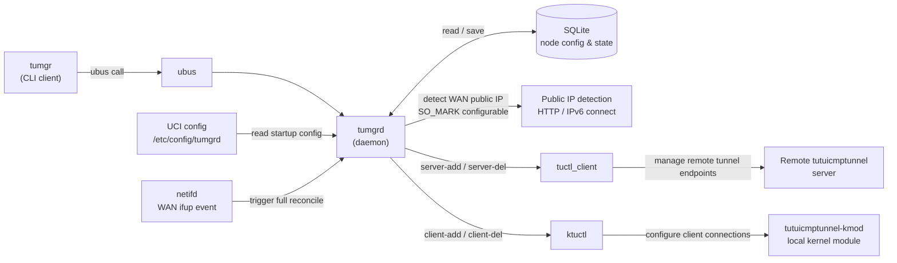
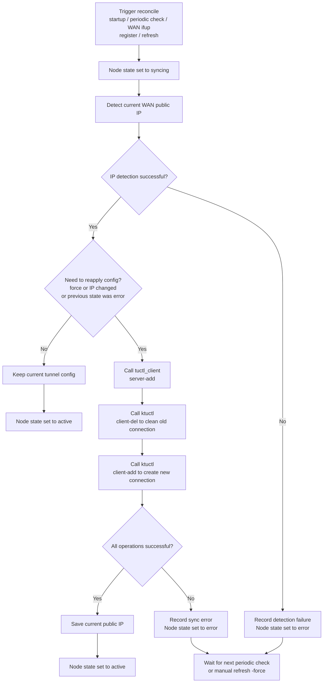
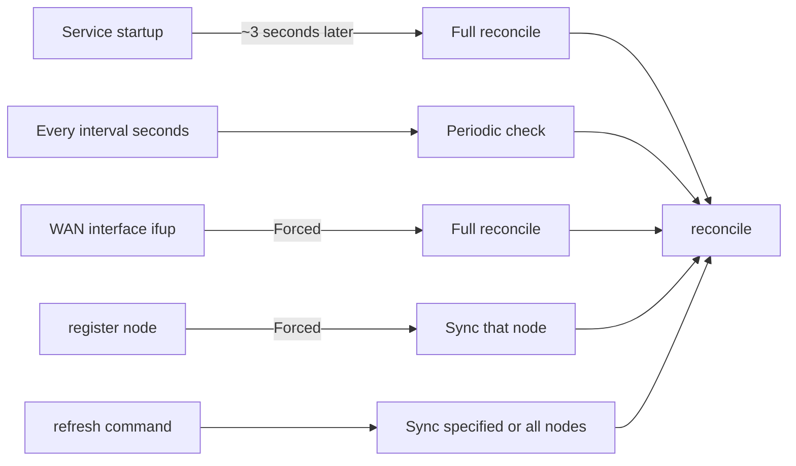
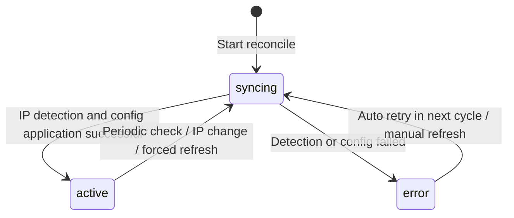
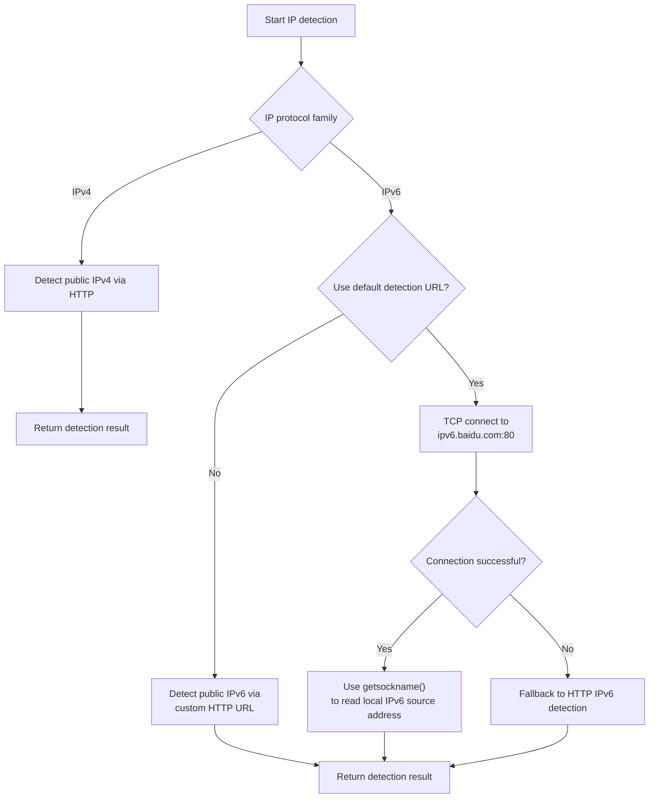
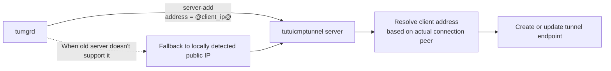

# tumgrd

[English](README.md) | [中文](README_zh-CN.md)

A node management daemon for `tutuicmptunnel` running on OpenWrt.

`tumgrd` maintains the configuration on both ends of an ICMP tunnel: it registers the local tunnel endpoint with a remote `tutuicmptunnel` server and configures the local [`tutuicmptunnel-kmod`](https://github.com/hrimfaxi/tutuicmptunnel-kmod) kernel module client connection via `ktuctl`.

It is primarily designed for scenarios where the public IP changes dynamically, such as home broadband connections and enterprise gateways. When the WAN public IP changes, the WAN interface comes back online, or a previous sync fails, `tumgrd` automatically reapplies the tunnel configuration without requiring manual node deletion and re-registration.

## Features

- **Full Node Lifecycle Management**: Register, deregister, refresh, and query nodes; node configurations are persisted to SQLite and automatically restored after service restart.
- **Automatic Public IP Detection**: Supports IPv4/IPv6 HTTP detection and IPv6 TCP connect probing; detection URLs can be overridden per node.
- **Automatic Sync and Self-Healing**:
  - Automatic reconfiguration when public IP changes;
  - Forced sync when WAN interface triggers `ifup`;
  - Automatic retry in next check cycle when node is in `error` state;
  - Automatic restoration of saved nodes after startup.
- **`@client_ip@` Server-Side Resolution**: Client addresses can be resolved by the server, reducing the impact of local public IP detection errors and multi-layer NAT scenarios.
- **Automatic XOR Key Generation**: XOR keys can be automatically generated for newly registered nodes.
- **Transparent Proxy Coexistence**: Public IP detection traffic can set `SO_MARK` to avoid being incorrectly hijacked by local transparent proxies or policy routing.
- **ubus Management Interface**: Nodes can be managed via `tumgr` CLI or direct `ubus` calls.

## How It Works

### Architecture



Component Responsibilities:

| Component | Responsibility |
|---|---|
| `tumgrd` | Resident daemon; maintains node desired and runtime state; provides `ubus` object `tumgrd`. |
| `tumgr` | Shell CLI client that wraps `ubus call tumgrd ...` calls. |
| `tuctl_client` | Adds or removes tunnel endpoints on the remote `tutuicmptunnel` server. |
| `ktuctl` | Configures client connections for the local `tutuicmptunnel-kmod` kernel module. |
| SQLite | Stores node configurations and last sync state for restoration after service restart. |

### Node Data Model

A node is uniquely identified by the following fields:

```text
(server_host, server_port, uid, ip_version)
```

Where:

- `server_host`: Remote tunnel server address;
- `server_port`: Remote tunnel server port;
- `uid`: Node identifier;
- `ip_version`: `ipv4`, `ipv6`, or left blank for automatic selection.

Within the same remote server and IP protocol family, `client_port` must be unique. If a registered node conflicts with an existing node's port, the database constraint will reject the operation.

### Automatic Sync Flow

`tumgrd` uses a reconcile mechanism to reapply the desired node configurations from the database to the remote server and local kernel module.



The sync decision logic can be summarized as:

```text
need_apply = force || ip_changed || was_error
```

That is, the node will reapply its configuration when any of the following conditions are met:

- Forced refresh is called;
- Public IP change is detected;
- Node's previous sync was in `error` state.

### Automatic Sync Triggers



| Trigger | Behavior |
|---|---|
| ~3 seconds after daemon startup | Execute a full reconcile on all saved nodes. |
| Every `interval` seconds | Check node public IP and state; reapply if IP changed or node is in error state. |
| WAN interface `ifup` | Force reconcile on all nodes. |
| After successful `register` | Immediately force sync that node. |
| `refresh` command | Manually sync specified or all nodes. |

### Node States



| State | Meaning |
|---|---|
| `active` | Node's last sync was successful; local and remote configurations should be in normal state. |
| `syncing` | Currently detecting IP or executing remote/local tunnel configuration. |
| `error` | Last sync failed; will automatically attempt recovery in the next periodic check. |

## Public IP Detection

Default IP detection URL:

```text
http://ip.3322.net/
```

Can be overridden per node during registration using `ip_check_url`.

### IPv4 and IPv6 Detection Strategy



- IPv4 typically detects the public exit address via HTTP request.
- IPv6 with default detection URL prioritizes TCP connect probing:
  1. Initiates TCP connection to `ipv6.baidu.com:80`;
  2. Reads the actual local IPv6 source address used via `getsockname()`;
  3. If probing fails, falls back to HTTP detection.
- With custom `ip_check_url`, HTTP detection is performed according to the specified URL.

> Currently only `http://` detection URLs are supported; `https://` is not supported.

### Transparent Proxy Coexistence

Public IP detection traffic sets `SO_MARK` with a default value of `2`. This can work with policy routing rules to let detection connections bypass local transparent proxies, such as `xtp-rs`, TPROXY, or other firewall mark-based proxy solutions.

Configurable via daemon parameter:

```bash
tumgrd --fwmark 2
```

## `@client_ip@` Placeholder

When `use_client_ip` is enabled, `tumgrd` sets the address field to:

```text
@client_ip@
```

when executing `server-add` to the remote server, allowing the remote `tutuicmptunnel` server to resolve the client IP based on the actual connection peer.



This is particularly useful in the following scenarios:

- Local public IP detection service returns incorrect address;
- Client is behind multi-layer NAT;
- IPv4/IPv6 exit routing is complex;
- The source address seen by the server is more trustworthy than local detection results.

If the remote `tuctl_server` version doesn't support this placeholder, `tumgrd` will fall back to using the locally detected public IP.

Enabled by default; can be disabled with `--no-client-ip`.

## Installation

### Dependencies

Runtime environment:

- OpenWrt;
- `libubus`, `libubox`;
- `sqlite3`, `libsqlite3`;
- `libuci`: Optional, for WAN interface detection;
- `tutuicmptunnel-kmod` kernel module;
- `tuctl_client`, `ktuctl` tools.

The `tuctl_client` and `ktuctl` come from the [`tutuicmptunnel-kmod`](https://github.com/hrimfaxi/tutuicmptunnel-kmod) project.

### Local Build

```bash
mkdir build
cd build
cmake ..
make
```

### OpenWrt Cross-Compilation

Taking aarch64 as an example:

```bash
mkdir build-aarch64
cd build-aarch64
cmake -DCMAKE_TOOLCHAIN_FILE=../openwrt-aarch64.cmake ..
make
```

The project provides the following toolchain files:

- `openwrt-aarch64.cmake`
- `openwrt-x86_64.cmake`
- `openwrt-ramips.cmake`

### Building OpenWrt Packages (ipk / apk)

See the [`openwrt-tumgrd`](https://github.com/hrimfaxi/openwrt-tumgrd) repository for instructions.

### Deploy to OpenWrt

Copy files to the router:

```bash
# Daemon
scp tumgrd root@<router>:/usr/sbin/tumgrd

# CLI client
scp tumgr root@<router>:/usr/bin/tumgr

# init script and UCI config
scp contrib/etc/init.d/tumgrd root@<router>:/etc/init.d/tumgrd
scp contrib/etc/config/tumgrd root@<router>:/etc/config/tumgrd
```

Set executable permissions for CLI and enable the service on the router:

```bash
ssh root@<router> 'chmod +x /usr/bin/tumgr'
ssh root@<router> '/etc/init.d/tumgrd enable'
ssh root@<router> '/etc/init.d/tumgrd start'
```

## UCI Configuration

Configuration file: `/etc/config/tumgrd`

```uci
config tumgrd 'main'
    option enabled '1'
    option database '/lib/tumgrd/tumgrd.db'
    option interval '60'
    option log_level 'info'
    option enable_xor '1'
    option use_client_ip '1'
```

| Option | Default | Description |
|---|---:|---|
| `enabled` | `1` | Whether to enable the service. |
| `database` | `/lib/tumgrd/tumgrd.db` | SQLite database path. |
| `interval` | `60` | Periodic check interval in seconds. |
| `log_level` | `info` | Log level: `error`, `warn`, `info`, `debug`, `trace`. |
| `enable_xor` | `0` | Whether to automatically generate XOR keys for newly registered nodes. |
| `use_client_ip` | `1` | Whether to use `@client_ip@` placeholder for server-side client address resolution. |

## Usage

### `tumgr` CLI

#### Register Node

```bash
tumgr register -uid my-node-01 \
  -server-host 192.168.1.100 \
  -server-port 14801 \
  -client-port 1443 \
  -psk my-secret-password \
  -description "Main server" \
  -client-comment "my-node-01"
```

Optional parameters:

```text
-memlimit <bytes>
-ip-check-url <url>
-ip-version <ipv4|ipv6>
```

Example with 1 MiB memory limit:

```bash
tumgr register -uid my-node-01 \
  -server-host 192.168.1.100 \
  -server-port 14801 \
  -client-port 1443 \
  -psk my-secret-password \
  -memlimit 1048576
```

#### Deregister Node

```bash
tumgr deregister -uid my-node-01 \
  -server-host 192.168.1.100 \
  -server-port 14801 \
  -ip-version ipv4
```

#### Manual Refresh

Refresh a single node:

```bash
tumgr refresh -uid my-node-01 \
  -server-host 192.168.1.100 \
  -server-port 14801 \
  -ip-version ipv4 \
  -force
```

Refresh all nodes:

```bash
tumgr refresh -all -force
```

Without `-force`, configuration is only reapplied when the public IP changes or the node is in `error` state.

#### View Status

```bash
tumgr status
tumgr status -json
tumgr dump
```

- `status`: Table format status;
- `status -json`: JSON format status;
- `dump`: Output raw node JSON data.

## ubus API

The daemon exposes the following ubus object:

```text
tumgrd
```

Can be called directly:

```bash
ubus call tumgrd status
```

### Method Overview

| Method | Purpose |
|---|---|
| `register` | Create or update a node and immediately attempt sync. |
| `deregister` | Delete a node and clean up remote and local tunnel configurations. |
| `refresh` | Manually refresh specified or all nodes. |
| `status` | Get node status list. |
| `dump` | Get complete raw node data. |

### `register`

Example:

```bash
ubus call tumgrd register '{
  "uid": "my-node-01",
  "server_host": "192.168.1.100",
  "server_port": 14801,
  "client_port": 1443,
  "psk": "my-secret",
  "memlimit": 1048576
}'
```

Parameters:

| Parameter | Required | Description |
|---|---:|---|
| `uid` | Yes | Unique node identifier; cannot be empty or contain whitespace/control characters. |
| `server_host` | Yes | Remote `tutuicmptunnel` server hostname or IP address. |
| `server_port` | Yes | Remote server port. |
| `client_port` | Yes | Local client port. |
| `psk` | Yes | Pre-shared key. |
| `description` | No | Node description. |
| `client_comment` | No | Local client comment. |
| `memlimit` | No | Memory limit; set when greater than `0`, clear when `0`. |
| `ip_check_url` | No | Override default public IP detection URL. |
| `ip_version` | No | `ipv4`, `ipv6`, or leave blank for automatic selection. |
| `xor` | No | Specify XOR key; can override automatic generation behavior. |

Response typically contains:

| Field | Description |
|---|---|
| `status` | `ok` or `stored_but_apply_failed`. The latter means configuration is saved but immediate sync failed. |
| `action` | `created` or `updated`. |
| `applied` | `1` indicates successful application this time; `0` indicates unsuccessful. |
| `node` | Complete node fields and current state. |

### `deregister`

```bash
ubus call tumgrd deregister '{
  "uid": "my-node-01",
  "server_host": "192.168.1.100",
  "server_port": 14801,
  "ip_version": "ipv4"
}'
```

Possible return statuses:

| Status | Meaning |
|---|---|
| `deleted` | Completed remote, local, and database cleanup. |
| `not_found` | Corresponding node not found. |
| `deleted_with_cleanup_errors` | Database record deleted, but errors occurred during remote or local configuration cleanup. |

Return results may include the following cleanup details:

```text
server_deleted
client_deleted
db_deleted
```

### `refresh`

Refresh all nodes:

```bash
ubus call tumgrd refresh '{
  "all": true,
  "force": true
}'
```

Refresh specified node:

```bash
ubus call tumgrd refresh '{
  "uid": "my-node-01",
  "server_host": "192.168.1.100",
  "server_port": 14801,
  "ip_version": "ipv4",
  "force": true
}'
```

Parameter rules:

- Use `all: true` to refresh all nodes;
- Or specify `uid`, `server_host`, `server_port`, `ip_version` to refresh a single node;
- `force: true` ignores whether IP has changed and forces configuration reapplication;
- Non-forced refresh only processes nodes where IP has changed or current state is `error`.

### `status` and `dump`

```bash
ubus call tumgrd status
ubus call tumgrd dump
```

Both return node lists; `dump` is more suitable for programmatic reading and troubleshooting.

> Note: Response content may contain `psk` and XOR keys in plaintext. Please restrict ubus call permissions.

## Daemon Command Line Parameters

```text
Usage: tumgrd [options]

Options:
  -d, --database PATH      SQLite database path
                            Default: /lib/tumgrd/tumgrd.db

  -i, --interval SEC       Periodic check interval in seconds
                            Range: 10-3600
                            Default: 60

  -s, --socket PATH        ubus socket path
                            Default: system default socket

      --log-level LEVEL    Log level:
                            trace|debug|info|warn|error
                            Default: info

      --enable-xor         Auto-generate XOR keys for newly registered nodes

      --disable-xor        Disable XOR key auto-generation
                            Default behavior

      --use-client-ip      Use @client_ip@ placeholder for server-side client address resolution

      --no-client-ip       Disable @client_ip@, use locally detected public IP

      --fwmark NUM         SO_MARK value for IP detection connections
                            Range: 0-255
                            Default: 2

  -h, --help               Show help
```

## LuCI Web Management Interface

[`luci-app-tumgrd`](https://github.com/hrimfaxi/luci-app-tumgrd) provides a LuCI-based web management interface, supporting node registration/editing/deletion, status viewing, one-click refresh, and other features. See the project homepage for details.

## Operations and Troubleshooting

### Viewing Logs

```bash
logread -e tumgrd
```

After increasing log verbosity, you can further view sync processes, IP detection, and external command invocations:

```uci
config tumgrd 'main'
    option log_level 'debug'
```

### Node in `error` State

Check logs first:

```bash
logread -e tumgrd
```

Common causes:

- WAN not properly connected to network;
- Public IP detection URL inaccessible;
- IPv6 exit unavailable;
- Remote server unreachable;
- `psk` mismatch;
- `tuctl_client` or `ktuctl` execution failed;
- Local port or remote node configuration conflict.

Nodes entering `error` state don't need re-registration; `tumgrd` will automatically retry in subsequent cycles. You can also manually force refresh:

```bash
tumgr refresh -all -force
```

### `client_port` Conflict

Within the same remote server and IP protocol family, `client_port` must be unique.

If you get a database constraint error during registration, check if another node already occupies the same `client_port`.

### Modifying Node Parameters

Re-execute `register` with the same primary key to update the node:

```text
(server_host, server_port, uid, ip_version)
```

Updated nodes will immediately execute a forced sync.

## Security Notes

- `psk` and XOR keys are stored in plaintext in the SQLite database.
- `ubus` `register`, `status`, and `dump` responses may contain sensitive information like `psk` and XOR keys.
- It is recommended to restrict access to the `tumgrd` object via OpenWrt ubus ACL for untrusted users or services.
- Public IP HTTP detection uses plaintext `http://`; detection results may be affected by man-in-the-middle attacks on the link.
  - This affects the detected public address;
  - It does not replace or weaken the authentication information used by the tunnel itself.

## License

This project is released under the [GNU General Public License v2.0](https://www.gnu.org/licenses/old-licenses/gpl-2.0.html) (GPL-2.0).

GPL-2.0 allows copying, distributing, and modifying software, but requires retaining the license, copyright, and no-warranty statements when distributing the program or its derivative works; when distributing executable files, you must also provide the corresponding source code or a valid way to obtain the source code as required by the license.